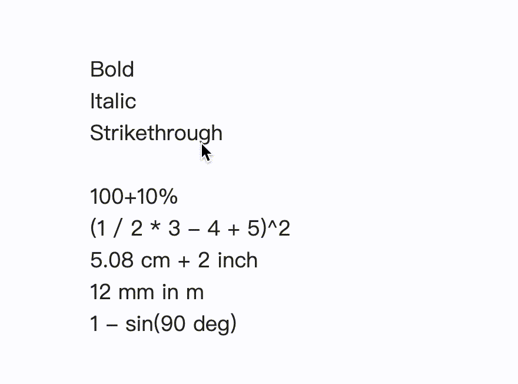

# Obsidian PopKit

Obsidian PopKit is a powerful plugin for [Obsidian](https://obsidian.md/), providing a suite of built-in tools to enhance your note-taking and productivity workflows. Inspired by the Mac software [PopClip](https://pilotmoon.com/popclip/), PopKit offers quick access to a variety of useful utilities.

## Installation

1. Open Obsidian and go to **Settings** > **Community plugins**.
2. Click on **Browse** and search for "Obsidian PopKit".
3. Click **Install**.
4. Once installed, enable the Obsidian PopKit plugin from the **Installed plugins** list.

## Usage

After installing and enabling the plugin, you can access the various tools via the PopKit toolbar. The toolbar can be customized from the plugin settings to include only the tools you frequently use.

### How to Use

- Select a piece of text in the Obsidian editor, and the PopKit toolset will instantly appear. Click on a tool to use it.

- You can manually invoke the PopKit toolbar using the command "show PopKit" (of course, assigning a shortcut key to this command would be more convenient). Since there might be no selected content at this point, some built-in actions may not be relevant, and the tooltip will exclude those tools.

- In fact, the PopKit toolbar can display quite dynamic content. As mentioned earlier, it can decide whether to show specific buttons based on whether there is selected text. Additionally, it can perform mathematical calculations, display date and time, count words, and more. Below is an example of mathematical calculations.

## Customization

You can customize the tools available in the PopKit toolbar by going to **Settings** > **PopKit** and selecting the tools you want to enable or disable.

- This plugin comes with dozens of tools. To enable the ones you want, simply drag them into the preview toolbar in the settings interface.

- The tools in the preview toolbar can be freely dragged to adjust their order. If you want to remove a tool, simply drag it from the preview toolbar to the delete box.

- In addition to the built-in tools, you can easily add any Obsidian built-in commands or commands registered by enabled plugins as custom tools. To enable a custom tool, simply drag it into the preview toolbar.

## Future Features

- [ ] Allow users to add custom tools.

---

Thank you for using Obsidian PopKit! We hope it enhances your productivity and note-taking experience.
