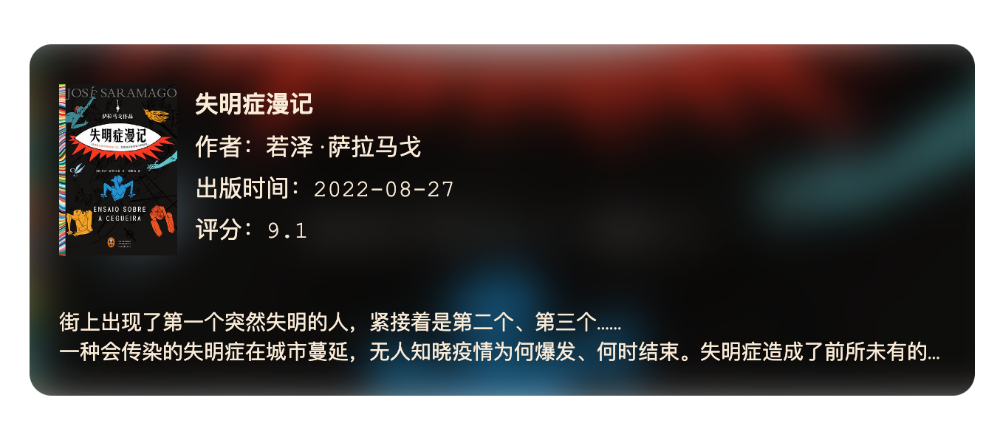
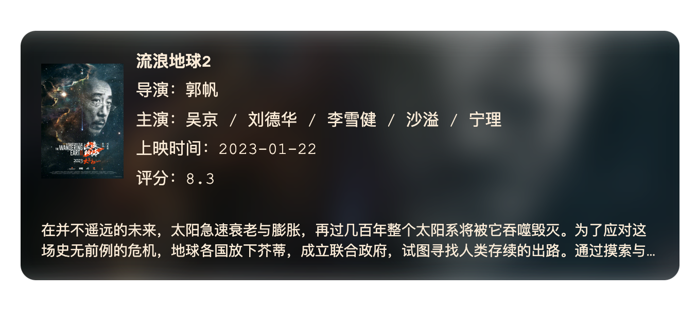

# Obsidian Markdown Media Card Plugin

 

## About

This is a plugin for Obsidian that allows you to insert media information cards in Markdown, such as Douban books, music, movies, etc.

This project was inspired by [hexo-douban-card](https://github.com/TankNee/hexo-douban-card) and references the design and implementation of the card style. However, it does not have the ability to fetch Douban information. Instead, it allows users to freely configure the content displayed on the card, which can be completely unrelated to Douban.

This Obsidian plugin is a wrapper for the [Remark Media Card](https://github.com/zhouhua/remark-media-card). Please refer to [Remark Media Card](https://github.com/zhouhua/remark-media-card) for more information.

## Installation

Search `Markdown Media Card` in community plugins.

## Examples

<div align="cneter"></div>

````
```media-card
type: book
url: https://book.douban.com/subject/35984787/
title: Blindness Chronicles
cover: https://img3.doubanio.com/view/subject/s/public/s34269503.jpg
publishDate: 2022-08-27
author: 若泽·萨拉马戈
rating: 9.1
width: 600
introduction: |-
  街上出现了第一个突然失明的人，紧接着是第二个、第三个……
  一种会传染的失明症在城市蔓延，无人知晓疫情为何爆发、何时结束。
  失明症造成了前所未有的恐慌与灾难，一批又一批感染者被集中隔离。
  食物短缺，组织崩溃，文明与尊严变得不堪一击。
  人们逐渐剥离道德的外衣，陷入比失明更绝望的苦难境地。
  在这些人中，只有一个女人还能看见。
  她的眼睛，是这个疯狂的世界里唯一尚存的理智。
```
````

---

<div align="cneter"></div>

````
```media-card
type: music
url: https://music.163.com/#/song?id=19292984
title: Love Story
cover: https://p1.music.126.net/GZERNplXUdzTPkKqo2F4tA==/109951169217536854.jpg
artist: Taylor Swift
width: 600
```
````

---

<div align="cneter"></div>

````
```media-card
type: movie
url: https://movie.douban.com/subject/35267208/
title: 流浪地球2
cover: https://img9.doubanio.com/view/photo/s/public/p2885842436.jpg
director: 郭帆
actors: 吴京 / 刘德华 / 李雪健 / 沙溢 / 宁理
publishDate: 2023-01-22
rating: 8.3
introduction: |-
  在并不遥远的未来，太阳急速衰老与膨胀，再过几百年整个太阳系将被它吞噬毁灭。为了应对这场史无前例的危机，地球各国放下芥蒂，成立联合政府，试图寻找人类存续的出路。通过摸索与考量，最终推着地球逃出太阳系的“移山计划”获得压倒性胜利。人们着手建造上万台巨大的行星发动机，带着地球踏上漫漫征程。满腔赤诚的刘培强（吴京 饰）和韩朵朵（王智 饰）历经层层考验成为航天员大队的一员，并由此相知相恋。但是漫漫征途的前方，仿佛有一股神秘的力量不断破坏者人类的自救计划。看似渺小的刘培强、量子科学家图恒宇（刘德华 饰）、联合政府中国代表周喆直（李雪健 饰）以及无数平凡的地球人，构成了这项伟大计划的重要一环……
width: 600
```
````

## Usage

### Markdown Syntax

For example, in this sample:

````
```media-card
type: music
url: https://music.163.com/#/song?id=19292984
title: Love Story
cover: https://p1.music.126.net/GZERNplXUdzTPkKqo2F4tA==/109951169217536854.jpg
artist: Taylor Swift
width: 600
```
````

We expand the markdown code block syntax, defining `media-card` as the identifier for the media information card, and then inputting the card information in [yaml](https://yaml.org/) format within the code block. For details on the parameters that can be configured in YAML, please refer to [Parameters](#Parameters)。

## Parameters

| Parameter    | Required |  Type  | Description                                                                                                                        |
| ------------ | :------: | :----: | ---------------------------------------------------------------------------------------------------------------------------------- |
| type         |   Yes    | string | Type, currently supports `movie`, `music`, `book`                                                                                  |
| url          |    No    | string | Link the card redirects to, e.g., Douban introduction page or music playback page. If not set, clicking the card will not redirect |
| title        |   Yes    | string | Media name (book title, music title, movie title, etc.)                                                                            |
| cover        |   Yes    | string | Cover image, web url(https://...) and obsidian vault path(../folder/xx.jpg or folder/xx.jpg) are supported                         |
| introduction |    No    | string | Introduction, can be multi-line text, but only the first 3 lines will be displayed on the card                                     |
| width        |    No    | number | Card width in pixels, defaults to full width if not set                                                                            |

Additionally, if users want to add some custom information, they can directly add it in YAML format as `key: value` pairs (`value` supports HTML tags). All content other than the parameters mentioned in the table above will be rendered, for example:

````
```media-card
type: music
title: Love Story
cover: https://p1.music.126.net/GZERNplXUdzTPkKqo2F4tA==/109951169217536854.jpg
歌手: Taylor Swift
专辑: <a href="https://music.163.com/#/album?id=1770438" target="_blank">《Fearless》</a>
width: 600
```
````

The rendered result is shown below:

<div align="cneter"></div>

`Singer` and `Album` are two custom fields, and the value of `Album` is a link that redirects to the album page when clicked.

## My Other Obsidian Plugins

- [export image](https://github.com/zhouhua/obsidian-export-image])
